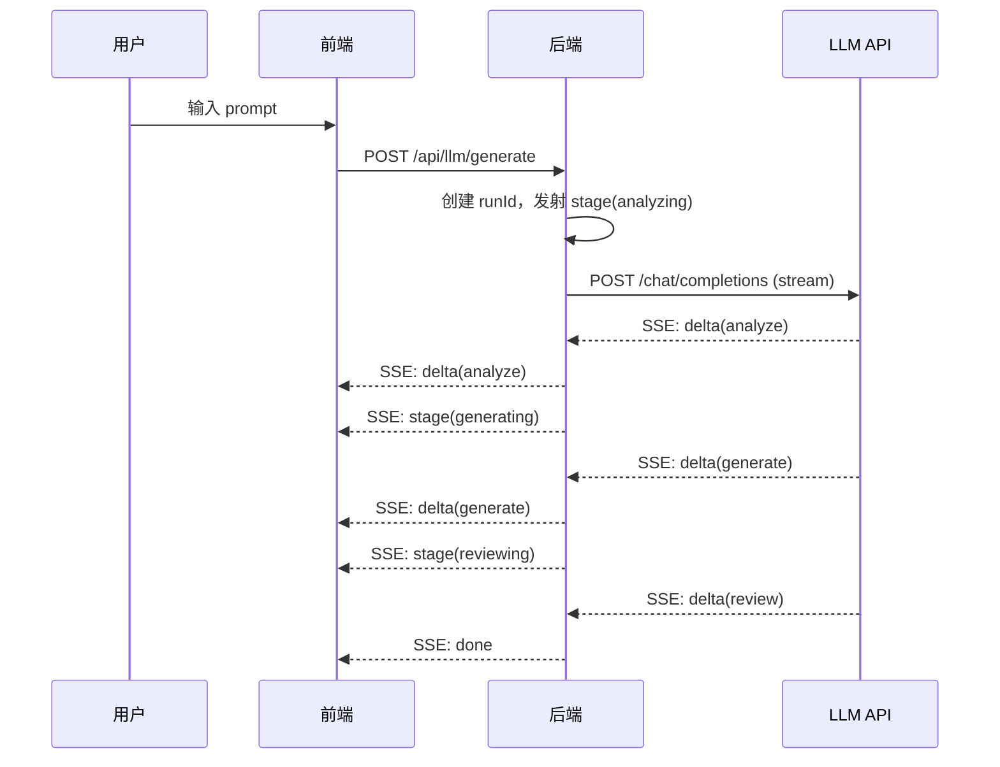

# Litpp Demo：后端 LLM 代理模式架构设计

> Owner：dev-litpp-ai-engineer
> 版本：v2（后端代理模式）
> 关联：`docs/tech-ai-pipeline.md`、`server/index.ts`、`src/services/ai/liveEngine.ts`

## 0. 变更概览

### 0.1 架构变更对比

| 维度 | v1（BYOK 模式） | v2（后端代理模式） |
|---|---|---|
| API Key 持有方 | 用户（localStorage） | 服务端（环境变量） |
| LLM 调用方式 | 前端直调 OpenAI 兼容 API | 前端调本地后端 → 后端代理调 LLM |
| 流式传输 | 浏览器直连 SSE | 前端调后端 SSE → 后端代理 SSE |
| 安全边界 | Key 不进日志，仅发给用户配置的 baseURL | Key 不进日志，请求来源校验，CORS 白名单 |
| 降级策略 | 后端不可用时回退 demoEngine | 后端不可用时回退 demoEngine（保持不变） |
| 适用场景 | 用户自带 key，隐私优先 | 产品提供 key，体验优先 |

### 0.2 核心决策

1. **前端零密钥**：前端代码中不再出现任何 API Key 相关逻辑，key 完全由服务端环境变量持有。
2. **协议不变**：后端代理透传相同的事件协议，前端事件处理逻辑保持不变。
3. **降级保留**：demoEngine 作为本地降级方案，后端不可用时自动启用。
4. **配置灵活**：支持通过 `.env` 配置多个 LLM provider（主备切换）。

---

## 1. 后端架构

### 1.1 新增路由

| 路由 | 方法 | 描述 | 入参 | 出参 |
|---|---|---|---|---|
| `/api/llm/generate` | POST | 生成流水线入口 | `{ prompt, options }` | SSE 流 |
| `/api/llm/health` | GET | LLM 服务健康检查 | - | `{ ok: boolean, model: string }` |

### 1.2 请求与响应协议

**请求**：
```typescript
interface GenerateRequest {
  prompt: string;          // 用户原始输入
  options?: {
    recentContext?: string;    // 迭代上下文（可选）
    currentHtml?: string;      // 当前 HTML（迭代时）
  };
}
```

**响应**：SSE 流，事件格式与 v1 保持一致：
```
event: stage
data: {"runId":"r_7f3a","stage":"analyzing","attempt":1,"message":"..."}

event: delta
data: {"runId":"r_7f3a","phase":"analyze","text":"..."}

event: done
data: {"runId":"r_7f3a","html":"...","warnings":[],"stats":{...}}

event: error
data: {"runId":"r_7f3a","code":"NETWORK_TIMEOUT","message":"...","retryable":true,"fallbackToDemo":true}
```

### 1.3 环境变量配置

`.env` 文件：
```bash
# 主 Provider（必填）
LLM_PROVIDER=agnes
LLM_API_KEY=sk-xxx
LLM_BASE_URL=https://api.agnes-ai.cn/v1
LLM_MODEL=agnes-3.0-flash

# 备用 Provider（可选）
LLM_FALLBACK_PROVIDER=openai
LLM_FALLBACK_API_KEY=sk-yyy
LLM_FALLBACK_BASE_URL=https://api.openai.com/v1
LLM_FALLBACK_MODEL=gpt-4o-mini

# 超时配置
LLM_FIRST_BYTE_TIMEOUT_MS=20000
LLM_STREAM_GAP_TIMEOUT_MS=90000
LLM_MAX_TOKENS_ENGINEER=8192
```

### 1.4 后端路由实现结构

```
server/
├── routes/
│   ├── health.ts          # 健康检查
│   ├── projects.ts        # 项目管理
│   └── llm.ts             # 新增：LLM 代理路由
├── services/
│   └── llm/
│       ├── pipeline.ts    # 流水线编排（从 liveEngine 移植）
│       ├── adapter.ts     # OpenAI 兼容适配器
│       ├── prompts.ts     # Prompt 模板
│       └── validator.ts   # HTML 校验
├── types/
│   └── llm.ts             # LLM 相关类型定义
└── index.ts               # 入口（挂载新路由）
```

---

## 2. 前端改造

### 2.1 liveEngine.ts 改造要点

**变更前**：
```typescript
// 直调 LLM API
const url = `${cfg.baseURL.replace(/\/+$/, '')}/chat/completions`;
const response = await fetch(url, {
  method: 'POST',
  headers: {
    'Content-Type': 'application/json',
    Authorization: `Bearer ${cfg.apiKey}`,
  },
  body: JSON.stringify({ ... }),
});
```

**变更后**：
```typescript
// 调用本地后端代理
const response = await fetch('/api/llm/generate', {
  method: 'POST',
  headers: {
    'Content-Type': 'application/json',
  },
  body: JSON.stringify({
    prompt,
    options: {
      recentContext: options.recentContext,
      currentHtml: options.currentHtml,
    },
  }),
});

// 读取 SSE 流
const reader = response.body.getReader();
// ...（SSE 解析逻辑保持不变）
```

### 2.2 配置变更

**移除**：
- `LiveEngineConfig` 中的 `apiKey`、`baseURL`、`model` 字段
- `PROVIDER_PRESETS` 常量
- localStorage 中的 `atoms.byok.v1` 配置

**保留**：
- `createLiveEngine()` 工厂函数（参数简化为无配置）
- `AIEngine` 接口不变

### 2.3 降级逻辑

```typescript
// 前端入口：aiService.ts
async function generate(prompt: string, options: GenerateOptions): Promise<void> {
  try {
    // 优先尝试后端代理
    const engine = createLiveEngine();
    await engine.generateStream(prompt, onEvent, options);
  } catch (error) {
    // 后端不可用时回退 demoEngine
    if (isBackendUnavailable(error)) {
      console.warn('[aiService] Backend unavailable, fallback to demo mode');
      const demoEngine = createDemoEngine();
      await demoEngine.generateStream(prompt, onEvent, options);
    } else {
      throw error;
    }
  }
}

function isBackendUnavailable(error: unknown): boolean {
  // 网络错误、连接拒绝、超时等
  if (error instanceof TypeError && error.message.includes('fetch')) {
    return true;
  }
  // HTTP 5xx
  if (error instanceof Response && error.status >= 500) {
    return true;
  }
  return false;
}
```

---

## 3. 安全设计

### 3.1 请求来源校验

后端 CORS 配置：
```typescript
app.use('/api/llm/*', cors({
  origin: isProduction
    ? [] // 生产同源
    : ['http://localhost:5173', 'http://localhost:3000'],
  allowMethods: ['POST'],
  allowHeaders: ['Content-Type'],
}));
```

### 3.2 密钥管理

- API Key 存储在 `.env` 文件，通过 `process.env.LLM_API_KEY` 读取
- `.env` 文件加入 `.gitignore`
- 日志中不输出密钥，错误信息中不包含密钥
- 生产环境建议使用密钥管理服务（如 AWS Secrets Manager）

### 3.3 请求限流（可选扩展）

```typescript
// 简单 IP 限流
const rateLimiter = new Map<string, { count: number; resetAt: number }>();

app.use('/api/llm/generate', async (c, next) => {
  const ip = c.req.header('x-forwarded-for') || 'unknown';
  const now = Date.now();
  const limit = rateLimiter.get(ip);

  if (limit && limit.count >= 10 && now < limit.resetAt) {
    return c.json({ error: '请求过于频繁，请稍后再试' }, 429);
  }

  await next();

  // 重置计数器
  if (!limit || now >= limit.resetAt) {
    rateLimiter.set(ip, { count: 1, resetAt: now + 60000 });
  } else {
    limit.count += 1;
  }
});
```

---

## 4. 流式事件协议（保持不变）

前端与后端之间的事件协议与 v1 保持一致，详见 `docs/tech-ai-pipeline.md` 第 3 节。

### 4.1 时序示例



---

## 5. 实现路径

### 5.1 后端实现步骤

1. **创建类型定义**：`server/types/llm.ts`
   - `GenerateRequest`、`StreamEvent`、`FeatureList` 等

2. **移植核心逻辑**：`server/services/llm/`
   - 从 `src/services/ai/` 移植：
     - `pipeline.ts`（流水线编排）
     - `adapter.ts`（OpenAI 兼容适配器）
     - `prompts.ts`（Prompt 模板）
     - `validator.ts`（HTML 校验）
   - 调整：读取配置从环境变量，emit 事件通过 Hono stream API

3. **新增路由**：`server/routes/llm.ts`
   - `POST /api/llm/generate`：接收请求，启动流水线，返回 SSE 流
   - `GET /api/llm/health`：健康检查

4. **配置环境变量**：`.env`
   - 填入 Provider 配置

5. **测试**：
   - 单元测试：流水线各阶段逻辑
   - 集成测试：端到端 SSE 流

### 5.2 前端实现步骤

1. **简化 liveEngine**：
   - 移除 API Key 相关逻辑
   - 改为调用 `/api/llm/generate`
   - SSE 解析逻辑保持不变

2. **更新 aiService**：
   - 添加降级逻辑：后端不可用时切换 demoEngine

3. **移除设置面板中的 BYOK 配置 UI**（可选）

---

## 6. 关键代码变更点

### 6.1 后端：新增类型定义

```typescript
// server/types/llm.ts

export interface GenerateRequest {
  prompt: string;
  options?: {
    recentContext?: string;
    currentHtml?: string;
  };
}

export type StreamEvent =
  | { type: 'stage'; payload: StagePayload }
  | { type: 'delta'; payload: DeltaPayload }
  | { type: 'done'; payload: DonePayload }
  | { type: 'error'; payload: ErrorPayload };

export interface StagePayload {
  runId: string;
  stage: 'analyzing' | 'generating' | 'reviewing';
  attempt: number;
  message: string;
  meta?: Record<string, unknown>;
}

export interface DeltaPayload {
  runId: string;
  phase: 'analyze' | 'generate' | 'repair';
  text: string;
}

export interface DonePayload {
  runId: string;
  html: string;
  warnings: string[];
  stats: {
    mode: 'live';
    inputTokens: number;
    outputTokens: number;
    durationMs: number;
    rounds: number;
  };
}

export interface ErrorPayload {
  runId: string;
  code: string;
  message: string;
  retryable: boolean;
  fallbackToDemo: boolean;
  detail?: string;
}
```

### 6.2 后端：新增路由

```typescript
// server/routes/llm.ts

import { Hono } from 'hono';
import { streamSSE } from 'hono/streaming';
import { runPipeline } from '../services/llm/pipeline.js';

const app = new Hono();

app.post('/generate', async (c) => {
  const body = await c.req.json<GenerateRequest>();
  const { prompt, options = {} } = body;

  return streamSSE(c, async (stream) => {
    const runId = `r_${Math.random().toString(36).slice(2, 8)}`;

    // 定义事件发射器
    const emit = async (event: StreamEvent) => {
      const eventType = event.type;
      await stream.writeSSE({
        event: eventType,
        data: JSON.stringify(event.payload),
      });
    };

    // 运行流水线
    try {
      await runPipeline(prompt, options, emit);
    } catch (error) {
      await emit({
        type: 'error',
        payload: {
          runId,
          code: 'INTERNAL_ERROR',
          message: '生成过程出现内部错误',
          retryable: true,
          fallbackToDemo: true,
          detail: error instanceof Error ? error.message : String(error),
        },
      });
    }
  });
});

app.get('/health', (c) => {
  const model = process.env.LLM_MODEL || 'unknown';
  return c.json({ ok: true, model });
});

export const llmRouter = app;
```

### 6.3 后端：流水线编排（移植与调整）

```typescript
// server/services/llm/pipeline.ts

import { ANALYST_SYSTEM_PROMPT, ANALYST_USER_PROMPT_TEMPLATE, ... } from './prompts.js';
import { validateGeneratedHtml } from './validator.js';
import { chatStream } from './adapter.js';

export async function runPipeline(
  prompt: string,
  options: GenerateOptions,
  emit: (event: StreamEvent) => Promise<void>
): Promise<void> {
  const runId = `r_${Math.random().toString(36).slice(2, 8)}`;
  const startedAt = Date.now();

  // 配置从环境变量读取
  const config = {
    baseURL: process.env.LLM_BASE_URL!,
    apiKey: process.env.LLM_API_KEY!,
    model: process.env.LLM_MODEL!,
    firstByteTimeoutMs: Number(process.env.LLM_FIRST_BYTE_TIMEOUT_MS) || 20000,
    streamGapTimeoutMs: Number(process.env.LLM_STREAM_GAP_TIMEOUT_MS) || 90000,
    engineerMaxTokens: Number(process.env.LLM_MAX_TOKENS_ENGINEER) || 8192,
  };

  // 分析师阶段
  await emit({ type: 'stage', payload: { runId, stage: 'analyzing', attempt: 1, message: '...' } });
  const features = await analystStage(prompt, options, config, emit);

  // 工程师阶段
  await emit({ type: 'stage', payload: { runId, stage: 'generating', attempt: 1, message: '...' } });
  const html = await engineerStage(features, prompt, options, config, emit);

  // 审查者阶段
  await emit({ type: 'stage', payload: { runId, stage: 'reviewing', attempt: 1, message: '...' } });
  const verdict = await reviewerStage(features, html, config, emit);

  // 交付
  await emit({
    type: 'done',
    payload: {
      runId,
      html,
      warnings: [],
      stats: {
        mode: 'live',
        inputTokens: 0,
        outputTokens: 0,
        durationMs: Date.now() - startedAt,
        rounds: 1,
      },
    },
  });
}
```

### 6.4 前端：liveEngine 改造

```typescript
// src/services/ai/liveEngine.ts（改造后）

export interface LiveEngineOptions {
  // 不再需要 apiKey/baseURL/model
}

export function createLiveEngine(_options?: LiveEngineOptions): AIEngine {
  return {
    mode: 'live',
    async generateStream(prompt, onEvent, generateOptions): Promise<void> {
      const controller = new AbortController();

      try {
        const response = await fetch('/api/llm/generate', {
          method: 'POST',
          headers: { 'Content-Type': 'application/json' },
          body: JSON.stringify({
            prompt,
            options: {
              recentContext: generateOptions?.recentContext,
              currentHtml: generateOptions?.currentHtml,
            },
          }),
          signal: controller.signal,
        });

        if (!response.ok) {
          throw new Error(`Backend error: ${response.status}`);
        }

        if (!response.body) {
          throw new Error('Empty response body');
        }

        // SSE 解析（与 v1 相同）
        const reader = response.body.getReader();
        const decoder = new TextDecoder();
        let buffer = '';

        for (;;) {
          const chunk = await reader.read();
          if (chunk.done) break;

          buffer += decoder.decode(chunk.value, { stream: true });
          // 解析 SSE 事件，调用 onEvent
          // ...
        }
      } catch (error) {
        if (error instanceof Error && error.name === 'AbortError') {
          onEvent(makeErrorEvent('r_unknown', 'CANCELLED', '已停止生成', false, false));
        } else {
          throw error;
        }
      }
    },

    cancelGeneration(): void {
      // AbortController.abort()
    },
  };
}
```

---

## 7. 测试计划

### 7.1 后端单元测试

- `pipeline.test.ts`：测试三阶段流水线逻辑
- `adapter.test.ts`：测试 OpenAI 兼容适配器
- `validator.test.ts`：测试 HTML 校验

### 7.2 集成测试

- 端到端测试：`POST /api/llm/generate` → SSE 流 → done/error
- 降级测试：后端不可用时前端切换 demoEngine

### 7.3 性能测试

- 流式传输延迟：首字节 < 2s
- 并发请求：支持 10 个并发 SSE 流

---

## 8. 迁移步骤

### 8.1 第一阶段：后端实现

1. 创建类型定义
2. 移植核心逻辑到后端
3. 新增路由并挂载
4. 配置环境变量
5. 测试后端独立可用

### 8.2 第二阶段：前端改造

1. 简化 liveEngine
2. 更新 aiService 降级逻辑
3. 移除 BYOK 配置 UI（可选）
4. 测试端到端流程

### 8.3 第三阶段：清理与优化

1. 移除前端残留的 API Key 相关代码
2. 更新文档
3. 添加监控与日志